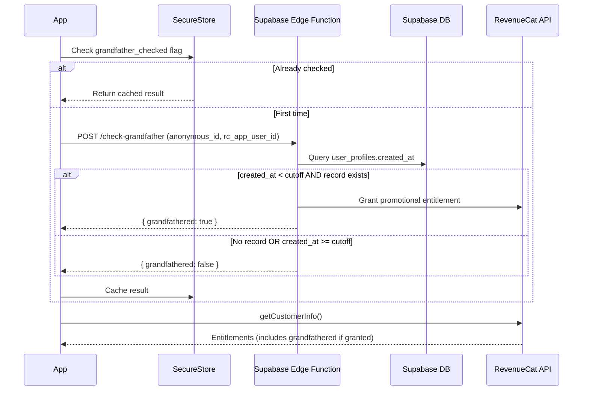

# RevenueCat Grandfather Flow via Supabase Edge Function

## Overview

Update the existing subscription logic to use a Supabase Edge Function that grants promotional entitlements in RevenueCat for grandfathered users. The app calls the Edge Function on first launch, which checks Supabase for user creation date and grants the entitlement via RevenueCat REST API if eligible.

## Architecture



## Implementation Tasks

- [ ] Create Supabase Edge Function `check-grandfather` that queries user_profiles and grants RevenueCat entitlement
- [ ] Update `useSubscription.ts` to call Edge Function instead of direct Supabase query
- [ ] Add `REVENUECAT_SECRET_API_KEY` to Supabase secrets

---

## Database Schema

The `user_profiles` table has a computed column that automatically determines grandfathering:

```sql
create table public.user_profiles (
  anonymous_id text not null,
  created_at timestamp with time zone not null,
  is_grandfathered boolean GENERATED ALWAYS as (
    created_at < '2026-02-01 00:00:00+00'::timestamp with time zone
  ) STORED null,
  rc_app_user_id text null,
  entitlement_granted_at timestamp with time zone null,
  updated_at timestamp with time zone null default now(),
  constraint user_profiles_pkey primary key (anonymous_id)
);
```

Key fields:
- `is_grandfathered` - Computed column, auto-calculated from `created_at`
- `rc_app_user_id` - RevenueCat user ID (stored after first check)
- `entitlement_granted_at` - Timestamp when entitlement was granted to RevenueCat

---

## Changes Required

### 1. Create Supabase Edge Function

Create `supabase/functions/check-grandfather/index.ts`:

- Receives: `{ anonymous_id: string, rc_app_user_id: string }`
- Queries `user_profiles` table for `is_grandfathered` and `entitlement_granted_at` by `anonymous_id`
- If no record exists: return `{ grandfathered: false }`
- If `is_grandfathered === false`: return `{ grandfathered: false }`
- If `is_grandfathered === true` AND `entitlement_granted_at` is null:
  - Call RevenueCat REST API to grant promotional entitlement
  - Endpoint: `POST https://api.revenuecat.com/v1/subscribers/{rc_app_user_id}/entitlements/{entitlement_id}/promotional`
  - Update `user_profiles` with `rc_app_user_id` and `entitlement_granted_at`
  - Return `{ grandfathered: true }`
- If `is_grandfathered === true` AND `entitlement_granted_at` is set:
  - Already granted, just return `{ grandfathered: true }`

### 2. Update hooks/useSubscription.ts

Modify `checkAndPersistGrandfathering()` function:

- Remove local Supabase query (move to Edge Function)
- Instead, call the Edge Function with `anonymous_id` and RevenueCat `app_user_id`
- Handle Edge Function response
- If `grandfathered: false` or Edge Function fails: do NOT grant (strict, no false positives)
- Cache result in SecureStore
- After check, always use `Purchases.getCustomerInfo()` as source of truth

Key change in error handling:

```typescript
// OLD: If Supabase fails, grant grandfathered (generous)
// NEW: If Edge Function fails, do NOT grant (strict)
```

### 3. Get RevenueCat App User ID

In the app, get the RevenueCat user ID to pass to Edge Function:

```typescript
const { appUserID } = await Purchases.getCustomerInfo();
// Pass this to Edge Function along with anonymous_id
```

### 4. Store RevenueCat Secret Key

Add to Supabase secrets (via CLI or dashboard):

- `REVENUECAT_SECRET_API_KEY` - Your RevenueCat secret key (starts with `sk_`)

---

## Files to Create/Modify

| File | Action |
|------|--------|
| `supabase/functions/check-grandfather/index.ts` | CREATE - Edge Function |
| `hooks/useSubscription.ts` | MODIFY - Call Edge Function instead of direct Supabase query |

---

## Grandfather Logic (Strict)

| Condition | Result |
|-----------|--------|
| No Supabase record | NOT grandfathered |
| Supabase/Edge Function error | NOT grandfathered |
| `is_grandfathered = false` | NOT grandfathered |
| `is_grandfathered = true` + not yet granted | GRANT via RevenueCat API, update `entitlement_granted_at` |
| `is_grandfathered = true` + already granted | Return success (no API call needed) |

The computed `is_grandfathered` column handles the date comparison in the database:
- `created_at < 2026-02-01` → `is_grandfathered = true`
- `created_at >= 2026-02-01` → `is_grandfathered = false`

---

## Testing

1. Deploy Edge Function to Supabase
2. Reset SecureStore flags via Settings debug panel
3. Test with user that has `created_at` before cutoff - should get premium
4. Test with new user - should see paywall
5. Test with network disabled - should NOT get grandfathered (strict)
