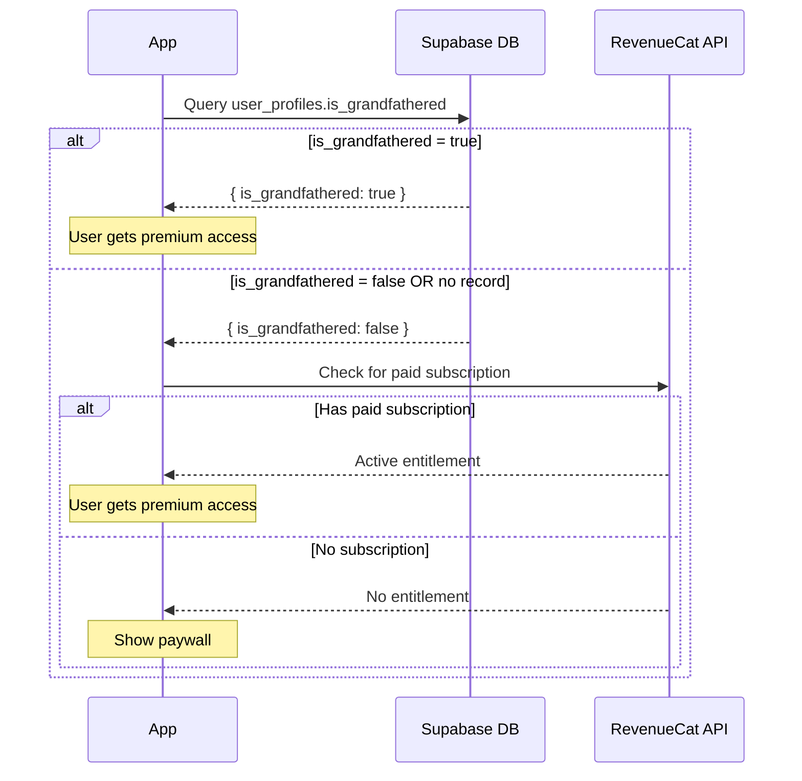

# Grandfather Flow with Direct Supabase Query

## Overview

Users who signed up before February 4, 2026 are grandfathered and receive premium access without paying. This is determined by checking the `is_grandfathered` computed column in the `user_profiles` table directly from the app.

## Architecture



## Database Schema

The `user_profiles` table has a computed column that automatically determines grandfathering:

```sql
create table public.user_profiles (
  anonymous_id text not null,
  created_at timestamp with time zone not null,
  is_grandfathered boolean GENERATED ALWAYS as (
    created_at < '2026-02-04 00:00:00+00'::timestamp with time zone
  ) STORED null,
  updated_at timestamp with time zone null default now(),
  constraint user_profiles_pkey primary key (anonymous_id)
);
```

Key fields:
- `is_grandfathered` - Computed column, auto-calculated from `created_at`
- Users with `created_at` before Feb 4, 2026 are grandfathered

---

## How It Works

### 1. App Initialization

When the app starts, `useSubscription.ts` performs these checks in order:

1. **Check grandfather status** - Query `user_profiles.is_grandfathered` using the device's `anonymous_id`
2. **Check RevenueCat** - Get customer info for paid subscriptions

### 2. Premium Access Logic

A user has premium access if ANY of these conditions are true:

```typescript
const isPremium = isEntitled || isGrandfathered || isPremiumOverride || Platform.OS === 'web';
```

- `isEntitled` - User has active paid subscription in RevenueCat
- `isGrandfathered` - User's `is_grandfathered = true` in Supabase
- `isPremiumOverride` - Developer mode bypass (testing only)
- Web platform always has access

### 3. No Caching

The grandfather check happens each time the app initializes. There's no local caching - we always query the database to get the current status.

---

## Grandfather Logic (Strict)

| Condition | Result |
|-----------|--------|
| No Supabase record | NOT grandfathered |
| Query error | NOT grandfathered |
| `is_grandfathered = false` | NOT grandfathered |
| `is_grandfathered = true` | Grandfathered (premium access) |

The computed `is_grandfathered` column handles the date comparison in the database:
- `created_at < 2026-02-04` → `is_grandfathered = true`
- `created_at >= 2026-02-04` → `is_grandfathered = false`

---

## Files

| File | Purpose |
|------|---------|
| `hooks/useSubscription.ts` | Contains `checkGrandfatherStatus()` function that queries Supabase |
| `lib/supabase.ts` | Database types including `is_grandfathered` column |

---

## Testing

1. Reset app data via Settings debug panel
2. Test with user that has `created_at` before Feb 4, 2026 - should get premium
3. Test with new user - should see paywall
4. Test with network disabled - should NOT get grandfathered (strict, fails closed)
5. Test paid subscription - should work independently of grandfather status
